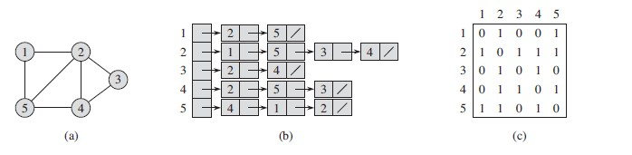

**Auto Snake**
<br> - *an elementary artificial intelligence project*

[](https://travis-ci.org/hubotio/hubot)
[](https://coveralls.io/github/hubotio/hubot?branch=master)

**Abstract**
We programmed an AI Snake that attempts to grow longer and eventually fills a canvas made up of 240x240 pixels (equivalently 12x12 blocks) by properly switching modes between eating food, chasing tail, and random moves. A-Star Search is applied to find the shortest paths from the snake's head to the food. Finding the longest paths is an NP-complete problem and is resolved with Hamiltonian cycles, and the time complexity is optimized using Dynamic Programming. The averaged snake's length after running five tests is 136.6 blocks, which occupies 94.8611% of the canvas' area. Compared to available GitHub projects using Reinforcement Learning (DQN), the conventionally implemented Snake AI in our project makes wiser decisions and fewer mistakes. We do not favor the application of deep learning algorithms in this project or any future release.

**Requirements**
* Python 3.5+ (64-bit)
* Turtle and Tkinter
* SDL and PyGame

**Keywords** Hamiltonian cycle, topological sort, priority queue, greedy algorithm, dynamic programming

---

The repository contains the following components:
* `snakePiegame.py` - final version
  - `Piegame.automate`
  - `Piegame.base`
  - `Piegame.gui`
* `snakeTortoise.py`
  - `Tortoise.automate`
  - `Tortoise.base`
  - `Tortoise.basics`


<small>Auto Snake running on a canvas of size 200x160 pixels (there are black margins around the game board!).</small>

**-- Algorithm Design --**

### Heuristic Path-Planning

*Depth-First Search* (DFS) and *Breadth-First Search* (BFS) - even a non-CS guy can quickly figure out how these algorithms work from their names. They are used for situations when topography is not a concern. The optimum paths found by these algorithms are "shortest" from the map view. Nevertheless, when topographical factors, such as mountains, must be considered, the moving cost between adjacent cells is not the same throughout the map. In such a situation, a game programmer has to use *Dijkstra* - an algorithm that takes the cost from the starting point to each next move into consideration.


<small>A comparison between DFS and Dijkstra on a map with terrains. Adapted from [zhihu.com](https://zhuanlan.zhihu.com/p/54510444).</small>

In the Snake game, the situation changes after each move. The optimum path, either the shortest or the longest, must be recalculated correspondingly. Besides, the searching target is switched between the food and the snake's tail. Although topography is not a concern in this game, we need an efficient algorithm to calculate the path in real-time. *A-Star*, published in 1968, is a widely used algorithm in computer games to navigate *Non-Player Characters* (NPC).

Based on the priorities calculated from a *Heuristic Function* (F=G+H), A-Star sorts all possible choices for the next move. G is the moving cost from the starting point to each possible move, H is an estimated distance from each possible move to the target. The method for distance estimation depends on the setting of the game:
* When four moving directions (U, D, L, and R) are permitted, the *Manhattan Distance* is used.
* In the case when eight moving directions are permitted, the *Diagonal Distance* is used.
* In the case when universal directions are permitted, the *Euclidean Distance* is used.


<small>The calculation of Manhattan Distance between two points. Adapted from [zhihu.com](https://zhuanlan.zhihu.com/p/54510444).</small>

The data structure for sorting the nodes is called *Priority-Queue*. In Snake, at most, three choices are available for the next move. A naive approach does not have an impact on efficiency. The anonymous function feature of Python, `lambda`, can help achieve the same purpose:
```Python
def manhattan(node_1, node_2):
    """Cost computation for the case that
    only four directions' moves are permitted."""

    dist_x = abs(node_2.x - node_1.x)
    dist_y = abs(node_2.y - node_1.y)

    return dist_x + dist_y

def astar(maze, start, current, end, visited=[], path=[]):
    """Subroutine for finding the optimum path in a maze
    by computing the cost of each move."""
    if current == end:
        return visited, path

    # enumerate unvisited connected neighbors
    choices = [N for N in maze.GetNeighbors(current) \
        if N not in visited]

    # when two nodes have the same H
    # the one with the smaller G comes first
    choices.sort(key=lambda c: manhattan(start, c))
    choices.sort(key=lambda c: manhattan(c, end))

    for next_move in choices:
        visited.append(next_move)
        path.append(next_move)
        v_final, p_final = \
            astar(maze, start, next_move, end, visited, path)
        if p_final is not None:
            return v_final, p_final
        else:
            path.pop()

    return visited, None
```
Just like DFS and BFS, A-Star Search is also a recursive algorithm. Pay attention to this line of code:
```Python
v_final, p_final = astar(maze, start, next_move, end, visited, path)
```
This is where the recursive level increases.

In the case a dead end is encountered, we have to remove the last appended node by calling `path.pop()`. When the algorithm backtracks, more nodes will be removed from `path` until the last visited junction is reached.

### Forward Checking

Even before checking any available projects, what came to my mind immediately is to dispatch a *virtual snake* for forward checking. In the Snake game, many dangerous situations cannot be predicted using one step forward (you have to consider the next few moves). For example, the food is between a gap between the wall and the snake with only one segment wide, or between a section of the snake and another section that is parallel.

In these dangerous situations, there is no space for turning its head after entering, if a naive approach is applied in my Snake AI. Although these are easily-avoidable situations for human players, they bring difficulty for AI designs. As the snake grows longer, it becomes more difficult to program (or even predict) all dangerous situations. By taking all of these conditions into consideration, there might be too many branches to program and may make the code unsightly.

Thus, it becomes natural to invoke a virtual snake (which does not have to be displayed on the screen) from the back end by creating a *deep copy* of my snake data structure (array or linked list). Like a *game tree* in Gomoku and chess AI (which are also NP problems), the virtual snake gives each possible route a trial starting from the current food and snake status.

Another situation that could require a game tree representation is the [Hanoi problem](https://www.sciencedirect.com/science/article/pii/S0166218X12000558). Each valid status is a vertex of a triangular configuration graph. There is an edge from one configuration to another if it is possible to transform one configuration into the other with a single simple move [Romik, 2006; Cohen, 2008; Berend, 2012].
```Python
def chaseTail(snake, canvas, food):
    """Forwards the snake one step towards its the tail."""

    fake_snake = snake[:]
    fake_canvas = resetCanvas(fake_snake, canvas, food)

    end_idx = fake_snake[-1].x + fake_snake[-1].y * MATRIX_W
    fake_canvas[end_idx] = FOODNUM
    v_food = fake_snake[-1]

    food_idx = food.x + food.y * MATRIX_W
    fake_canvas[food_idx] = MAXLENGTH

    result, refresh_tcanvas = runAstar(fake_snake, v_food, fake_canvas)
    fake_canvas = refresh_tcanvas

    fake_canvas[end_idx] = MAXLENGTH
    path = longestPath(fake_snake, fake_canvas)

    return path

def virtualMove(snake, canvas, food):
    """Forwards the snake one step virtually."""

    fake_snake = snake[:]
    fake_canvas = canvas[:]
    reset_tcanvas = resetCanvas(fake_snake, fake_canvas, food)
    fake_canvas = reset_tcanvas
    eaten = False

    while not eaten:
        refresh_tcanvas = runAstar(fake_snake, food, fake_canvas)[1]
        fake_canvas = refresh_tcanvas
        next_move = shortestPath(fake_snake, fake_canvas)
        snake_coords = fake_snake[:]
        fake_snake.insert(0, getHeadCoords(snake_coords, next_move))

        if fake_snake[0] == food:
            reset_tcanvas = resetCanvas(fake_snake, fake_canvas, food)
            fake_canvas = reset_tcanvas
            food_idx = food.x + food.y * MATRIX_W
            fake_canvas[food_idx] = MAXLENGTH
            eaten = True
        else:
            newHead_idx = fake_snake[0].x + fake_snake[0].y * MATRIX_W
            fake_canvas[newHead_idx] = MAXLENGTH
            end_idx = fake_snake[-1].x + fake_snake[-1].y * MATRIX_W
            fake_canvas[end_idx] = CKBBOARD
            del fake_snake[-1]

    return fake_snake, fake_canvas
```
In the above calculations, `food_idx = food.x + food.y * MATRIX_W` gives a zero-based, total cell count starting from the upper-left corner. The same rule is applied to `newHead_idx` and `end_idx`. The coordinate conversion trick is introduced in [Al Sweigart's tutorial](https://inventwithpython.com/pygame/) (a raw Snake game without AI). Many people develop their Snake AI by modifying Al Sweigart's work. So, if this project looks similar to anyone else's project in any way, there is no blame for plagiarism.

Subsequently, we need a subroutine, `isSafe(target, snake)`, to determine the security of the area between the snake's head and the target. The target could be food or the snake's tail. A full description of my routine is presented below:

1. <ins>Condition One</ins>: when the area between the snake's head and the food is secure (not any part of the snake's body is inside), ask the snake walk directly to the food following the shortest path possible.
2. <ins>Condition Two</ins>: if condition one is not satisfied, but there is a path between the snake's head and his tail, then ask the snake to chase his tail with a path that is as torturous as possible. Be aware that the canvas could be divided by the snake's body into several subareas that are not mutually connected.
3. When neither of the above two conditions is satisfied, ask the snake to wander. A virtual snake must be dispatched to help avoid dangerous moves. Continue applying this regime until any of the above two conditions again becomes `True`.

The condition check must be executed after each move. In addition to A-Star Search as preceding discussed, *Best-First Search* is an improvement from BFS and DFS, which runs in O[V+ElogE] time if implemented with a Priority Queue. Longest paths can be found with *Topological Sort* if a directed graph is acyclic - an algorithm that sorts a directed acyclic graph with the in-degrees of nodes [Khan, 2011] and has a time complexity of O[V+E], where V and E are the number of vertices and edges, respectively. That being said, most algorithms for acyclic (simple) graphs extend to cyclic graphs (multigraphs) with little or no modification.

Using Best-First Search to accelerate path-planning is an application of the *Greedy Algorithm*. The above AI routine is thus termed a *greedy strategy* from my perspective. In the greedy algorithm, a move that eventually leads to the optimal solution is called a *safe move*. Although the step is far from finding the critical path, it is the only move that must be taken to find the optimal solution. By reducing the problem recursively, we divide it into smaller subproblems so that we can conquer them more quickly, which is the main idea of the Greedy Algorithm.

<!-- That being said, a formal proof of correctness is usually required if you would like to use the Greedy Algorithm in any homework or exam. In some situations, <ins>greed means stupid</ins>. -->

### Longest Paths Algorithms

> A Hamiltonian path (or traceable path) is a path in an undirected or directed graph that visits each vertex exactly once.
> A Hamiltonian cycle (or Hamiltonian circuit) is a Hamiltonian path that is a cycle.

The definition from Wikipedia explicitly differentiates *Hamiltonian cycle* from *Hamiltonian path*, which is not a major issue we should worry about. In the case of programming Snake AI, it depends on whether the snake's body is included. If yes, then it forms a cycle. Therefore, finding a Hamiltonian path is equivalently finding a Hamiltonian cycle.

As people all know, walking directly to the tail is a dangerous move in the Snake game, which is the reason we have to make the path as roundabout as possible. The introduction of graph theory concepts is the most crucial part of this project - it increases the probability of filling the entire canvas with the snake's body. The basic requirement to guarantee such a path is that at least one of the two dimensions of the canvas must be even. Since we can't tell the snake whether he should spiral horizontally or vertically, a safer way to satisfy this requirement is to use even numbers in both dimensions.

In my first implementation (`Tortoise.automate`), I developed a subroutine to convert the empty cells on the canvas (that are not occupied by the snake's body) into a suitable structure for recursive searching. Although classes in the NumPy library allow traversing, they do not represent the relationship between each cell and its neighbors. Therefore, they are not considered "friendly" for implementing graph algorithms. In Computer Science, people rarely find NumPy useful for most algorithmic problems. In the case efficiency is the primary concern, there are many optimization methods you could use - a library for matrix and symbolic operations is not the only option. In the above case, insertion and deletion are frequent operations. A linked list is preferred.
```Python
import collections

class UndirectedGraph(collections.Sequence):
    """A data structure that allows
    bidirectional traversals."""
    def __init__(self, nodes=None):
        if nodes is None:
            nodes = []
        self.__nodes = nodes

    def InsertNode(self, node):
        if node not in self.__nodes:
            self.__nodes.append(node)

    def __str__(self):
        res = 'Nodes:\n'
        for node in self.__nodes:
            res += (str(node) + '\n')
        return res

g = UndirectedGraph()
g.InsertNode(source)
g.InsertNode(node_1)
g.InsertNode(node_2)
# ...
g.InsertNode(sink)
```
Although it is termed an *Undirected Graph*, we carefully specify the connected cells of `source` and `sink`, so that `source` is a vertex that has all edges pointing outward (deg<sup>-</sup>=0), and `sink` is a vertex that has only ingoing edges (deg<sup>+</sup>=0). Each time the body of the snake moves, the graph must be updated. A `Node` class for storing the coordinate of each cell is as follows:
```Python
from copy import deepcopy

class Node(object):
    """Data structure for representing
    each cell on the map."""
    def __init__(self, current, neighbors):
        self.__current = current
        self.__neighbors = neighbors

    @property
    def current(self):
        return self.__current  # deepcopy() removed

    @property
    def neighbors(self):
        return self.__neighbors  # deepcopy() removed

    def __eq__(self, other):
        if isinstance(other, Node):
            return self.current == other.current
        else:
            return NotImplemented

    def __repr__(self):
        name    = self.current
        content = self.neighbors
        return '{!r}: {!r}'.format(name, content)
```
<!-- To give these fundamental pieces of stuff a little bit explanation, `__current` is an instance of the `vector` class (see `Tortoise.base` for the implementation) that stores the coordinate of a cell; `__neighbors` is a list of `vector` instances. `@property` is a decorator that allows easier access to private members without violating their private properties. It converts magic methods `__set__()` and `__get__()` (which are called *containers*) into attributes and also makes our definition of `__eq__()` easier. `__repr__()` allows you to see the content of each node while debugging, not merely `<Node object at 0x10bfcda60>`. -->

Representation of graphs using a proper data structure is the foundation for implementing all path-planning algorithms, just like the examples show:



<small>An undirected graph (a) and its adjacency list (b) and adjacency matrix (c) representations. Adopted from https://www.cnblogs.com/xuqiang/archive/2011/03/28/1997680.html.</small>


<small>A directed graph (a) and its adjacency list (b) and adjacency matrix (c) representations. Adopted from https://www.cnblogs.com/xuqiang/archive/2011/03/28/1997680.html.</small>

The space complexity of the *Adjacency List* representation (used in this project) of a graph is O[V+E], regardless of whether the graph is directed or not. The resulting data structure allows us to list the (out-)neighbors of a node v in O[1+deg(v)] time. Similarly, we can determine whether u->v is an edge in O[1+deg(u)] time by scanning the neighbor list of u. Apparently, an adjacency matrix consumes more memory than adjacency lists for the same graph. However, if necessary, one could consider using an adjacency matrix for performance, because running time is more precious than memory.

Determining the existence of Hamiltonian paths or cycles is an NP-complete problem [Gurevich and Shelah, 1987]. There is no algorithm that can solve it in polynomial time. Without checking all the possibilities, it is not possible to tell which route is the longest. However, the time complexity can be reduced from O[n(n!)] to O[(2<sup>n</sup>)(n<sup>3</sup>)] with the assistance of *Dynamic Programming* [Pearce and Kelly, 2007], which follows the steps below:
1. Initialization, let `s = 1`, `t` be any adjacent point of `s`.
2. If the number of elements in `ans[]` is less than `n`, then expand outward from `t`, if there is an expandable point `v`, put it at the end of `ans[]`, and `t=v`, and continue to expand, if it cannot expand into <ins>Step 3</ins>.
3. Invert the currently obtained `ans[]`, swap `s` and `t`, and expand outward from `t`. If there is an expandable point `v`, put it at the end of `ans[]`, and `t=v`, and continue to expand. If it cannot be expanded Go to <ins>step 4</ins>.
4. If the current `s` and `t` are adjacent, go to <ins>step 5</ins>. Otherwise, traverse `ans[]` and find the point `ans[i]` so that `ans[i]` is connected to `t` and `ans[i + 1]` is connected to `s`, from `ans [i + 1]` to `t` part of `ans[]` inverted, `t=ans[i + 1]`, proceed to <ins>step 5</ins>.
5. If the number of elements in the current `ans[]` is equal to `n`, the algorithm ends, and the Hamiltonian loop is saved in `ans[]` (see whether the situation is added to the point `s`). Otherwise, if `s` and `t` are connected, but in `ans[]` If the number of elements of is less than `n`, then traverse `ans[]` and find the point `ans[i]` so that `ans[i]` is connected to a point (`j`) outside `ans[]`, then let `s=ans[i-1]`,`t = j`, invert the `ans[]` in `ans[]` from `s` to `ans[i-1]`, invert the `ans[i]` to `t` in `ans[]`, add point `j` to the end of `ans[]`, Go to <ins>step 2</ins>.

It can be shown that the existence of loops in a directed graph is contradictory to whether it can be linearly ordered. In Computer Science or Graph Theory, we are more concerned about a particular type of directed graph - *Directed Acyclic Graphs* (DAG). In the case of Snake, however, this is never possible.

For more information like this, please read Chapter 5, [Algorithms Unlocked](https://mitpress.mit.edu/books/algorithms-unlocked).

### Other Possibilities

Unfortunately, I am not a fan of big data or deep learning things; neither am I considering becoming a data scientist. My previous project that solves Sudoku puzzles using neural networks (available [here](https://github.com/gengyu89/Sudoku_ptah_training_model)) produced a mean accuracy of 80.0%. While there is no consequence for giving wrong answers to Sudoku puzzles, a wrong move in the Snake game may result in unresolvable situations. [A Snake AI](https://github.com/chuyangliu/snake) programmed with *Reinforcement Learning* (DQN) on GitHub have way shorter averaged snake lengths and smaller number of steps than other algorithms in the same repository.

**-- Appendix --**

Final lengths and percentages of coverage from five tests and their average values:

| Test | Length | Coverage [%] | Ending |
|:----:|:------:|:------------:|:------:|
|   0  | 129    |   89.5833    | **GO** |
|   1  | 142    |   98.6111    | **IL** |
|   2  | 139    |   96.5277    | **IL** |
|   3  | 135    |   93.7500    | **GO** |
|   4  | 138    |   95.8333    | **GO** |
| Mean | 136.6  |   94.8611    |        |

**GO**: Game Over <br> **IL**: Infinite Loop

Be aware that the food has taken one cell on the game board. A full coverage is prescribed to be (12x12-1)/(12x12) x 100% = 99.3056%.

A summary of path-planning algorithms for your interests:
* Dynamic-Window
* Grid based algorithms
  - Dijkstra
  - A* search  <!-- do not highlight with bold, an issue has happened -->
  - Potential Field algorithm
  - Grid-based coverage path planning
* State Lattice planning
  - Biased polar sampling
  - Lane sampling
* Probabilistic Road-Map (PRM)
* Rapidly-Exploring Random Trees (RRT)
  - RRT*
  - RRT* with Reeds-Shepp paths
  - LQR-RRT*
* Quintic polynomials planning
* Reeds Shepp planning
* LQR based path planning
* Optimal Trajectory in a Frenet Frame

**References**
* [HAS: Hierarchical A-Star Algorithm for Big Map Navigation in Special Areas](https://ieeexplore.ieee.org/abstract/document/6996764) <!-- a-star search -->
* [Snake game AI: Movement rating functions and evolutionary algorithm-based optimization](https://ieeexplore.ieee.org/abstract/document/7880166) <!-- forward checking -->
* [Directed Graphs](https://algs4.cs.princeton.edu/42digraph/) <!-- adjacency list -->
* [A graphical introduction to dynamic programming](https://medium.com/@avik.das/a-graphical-introduction-to-dynamic-programming-2e981fa7ca2) <!-- dynamic programming -->
* [Playing the Snake Game with Deep Reinforcement Learning](https://www.slideshare.net/ChuyangLiu2/playing-the-snake-game-with-deep-reinforcement-learning-chuyang-liu) <!-- DQN -->
* [Contraction Hierarchies](https://courses.cs.washington.edu/courses/cse332/20wi/homework/contraction/) <!-- extended reading -->
